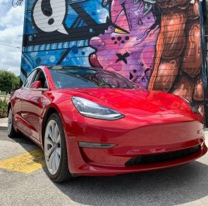

<h1>Welcome to Dana's GitHub Page!</h1> 
<figure>
  

    
  

</figure>
<h2>Dana's Bio</h2> 

My professional career began on nineteenth century square rigged shooners.

The Californian, Tole Mour, Adventuress, and the Pride of Baltimore II are examples of my schooner life.

<figure>
  

    
  <figcaption><em>Tallship "Californian" and me, repairing the Mainsail</em></figcaption>
  

</figure>
 

My undergraduate degrees are from the United States Merchant Marine Academy in Kings Pt, NY. As one of our  
  five federal service academies I recieved a congressional appointment to attend. The military structure encouraged 
  a degree of organization and precision. I was one of nine double majors in Marine Engineering and Marine
  Transportation.

I worked as an engineer aboard tankers, cruise ships, and container ships before switching gears and vetting for oil
  majors. 
  There I worked with projects as diverse as North Sea platform construction and STS ops in Uruguay.

<figure>
  

    
  <figcaption><em>Engine Room</em></figcaption>
  

</figure>
 

For the last four years I have worked as a freelance auditor for the military and oil and gas.

Finance peaked my interest and my company sent me to Harvard University for my graduate degree.

<figure>
  

    <figcaption><em>Graduation!</em></figcaption>
  

</figure>
 

Finance naturally led me to Data Analytics and I decided to attend a six month bootcamp at Rice University.

My love, though, is with cars. I've had many over the years beginning with Jeeps and now with a Tesla "Lucy" 
  and a Bentley coupe "Walter"

<figure>
   
  

    
    <figcaption><em>Lucy...0-60 in 3.9s and Walter...0-60 in 3.7s</em></figcaption>
  

</figure>
<figure>
  <figcaption><em>Oops...</em></figcaption>
  

  </figure>
</body>

</html>
